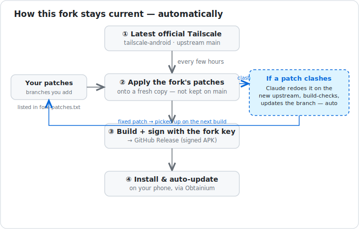

# Tailscale Android — unofficial fork builds

This repo auto-builds an **unofficial** fork of the Tailscale Android client. Every
6 hours it tracks upstream `tailscale/tailscale-android` `main`, layers a few extra
patches (see [`.github/fork-patches.txt`](.github/fork-patches.txt) — e.g. launcher
shortcuts to connect/disconnect), builds a debug APK signed with a stable key, and
publishes it to [Releases](../../releases).

> Not affiliated with or endorsed by Tailscale Inc. Use at your own risk.

## Why this exists

Years ago I wrote the original broadcast-intent support in the Tailscale Android app (`IPNReceiver`, the part that lets automation tools connect and disconnect the VPN). It worked well at the time. But as Android's background and power-management restrictions have tightened over the years (Doze, app standby, and aggressive OEM battery managers like Samsung's "deep sleep"), the broadcast approach became unreliable: it often can't wake the app once the system has stopped it.

So I wrote a fix: launcher shortcuts backed by a tiny activity that reliably wakes the app and starts the VPN, and opened it upstream as [tailscale/tailscale-android#810](https://github.com/tailscale/tailscale-android/pull/810). Like a lot of open source, review can take a while; maintainers are busy and a small feature can sit for a long time. I wanted to use it now.

The obvious workaround, building the app once with my patch and just running that, is a bad idea for a VPN: the moment you freeze on an old build you stop getting upstream's security fixes. So this fork does the opposite. It **rebuilds against the latest `tailscale/tailscale-android` automatically** (every few hours) and re-applies the patches on top, so I get my feature *and* every upstream change, with no manual effort (see the diagram above).

**This is an early-release process, not a competing app.** Tailscale is a security product that people trust, and I want this to stay as close to the real thing as possible; I'm not trying to take it in my own direction. So:

- **Every patch here is also an open PR upstream.** If a change isn't something genuinely trying to land in real Tailscale, it doesn't belong here. Once upstream merges a patch, it's dropped from this fork (you're back on stock).
- **It's all open, so please look.** The patches, the build, the signing, the auto-resolver: nothing is hidden, and I'd honestly rather you check than take my word for it.
- **Want a feature released early?** Open it as a PR upstream first, then I'm happy to consider adding it to the [patch list](.github/fork-patches.txt). Upstream-first is the rule precisely so this stays a preview of things heading into real Tailscale.

Ultimately I'm just someone who wanted this feature now without running a stale, insecure build. If you need vendor guarantees, use the official app. This is a convenience, offered in good faith.

## Included patches (not yet in upstream)

The changes this fork adds on top of upstream. Each lives on its own branch listed in
[`.github/fork-patches.txt`](.github/fork-patches.txt) and is re-applied on every build:

| Patch | What it does | Upstream PR |
|---|---|---|
| `app-shortcuts` | Launcher shortcuts (+ Tasker / Samsung Routines intents) to connect/disconnect the VPN, via a foreground trampoline that reliably wakes a stopped/deep-slept app | [tailscale/tailscale-android#810](https://github.com/tailscale/tailscale-android/pull/810) |

When a patch is merged upstream it's removed from the list (upstream already has it).

## Install

1. **Uninstall the official Tailscale app first.** This fork uses the same
   `applicationId` (`com.tailscale.ipn`) signed with a different key, so Android will
   not let both coexist or update one from the other.
2. Download the latest `tailscale-fork-signed.apk` from the [Releases page](../../releases).
3. Allow "install unknown apps" for your browser/file manager, then install.

## Auto-updates with Obtainium (recommended)

[Obtainium](https://github.com/ImranR98/Obtainium) installs and auto-updates the APK
straight from this repo's GitHub Releases:

1. Install Obtainium (from its [releases](https://github.com/ImranR98/Obtainium/releases), or F-Droid / IzzyOnDroid).
2. Tap **Add App** and paste this repo's URL:
   `https://github.com/brettjenkins/tailscale-android`
3. Obtainium finds the `tailscale-fork-signed.apk` asset — tap **Install**. It then
   offers each new 6-hourly build automatically.

> Because the signing key differs from the Play Store build, you cannot switch between
> this fork and the official app without uninstalling/reinstalling (which clears local
> app state, including your login).

## How it works

- The fork's patches are **not** stored on `main`; they are listed by commit SHA in
  `.github/fork-patches.txt` and re-applied onto a fresh `upstream/main` checkout on
  every build. Adding another change or someone else's unmerged PR is a one-line edit.
- If upstream changes collide with a patch, that build ships **without** the patch and
  opens a `fork-conflict` issue; the patch is never silently dropped.

## Security

This is a VPN client. Builds are produced unattended by GitHub Actions and signed with
a key held only as a repository secret. The build/test gate must pass before anything is
published. Still — it's an unofficial fork; if you need vendor guarantees, use the
official app.
